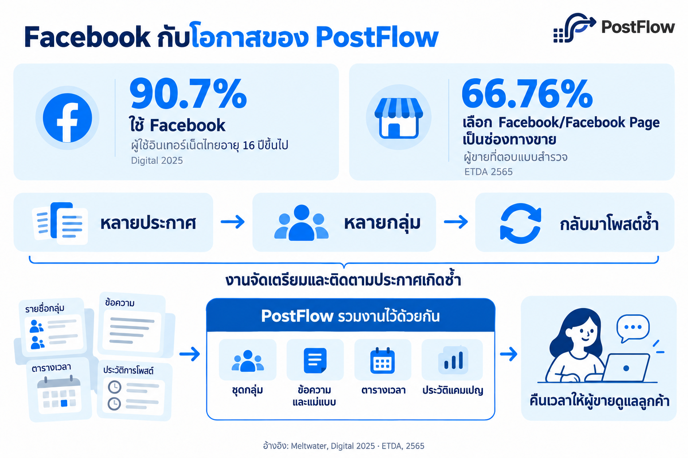
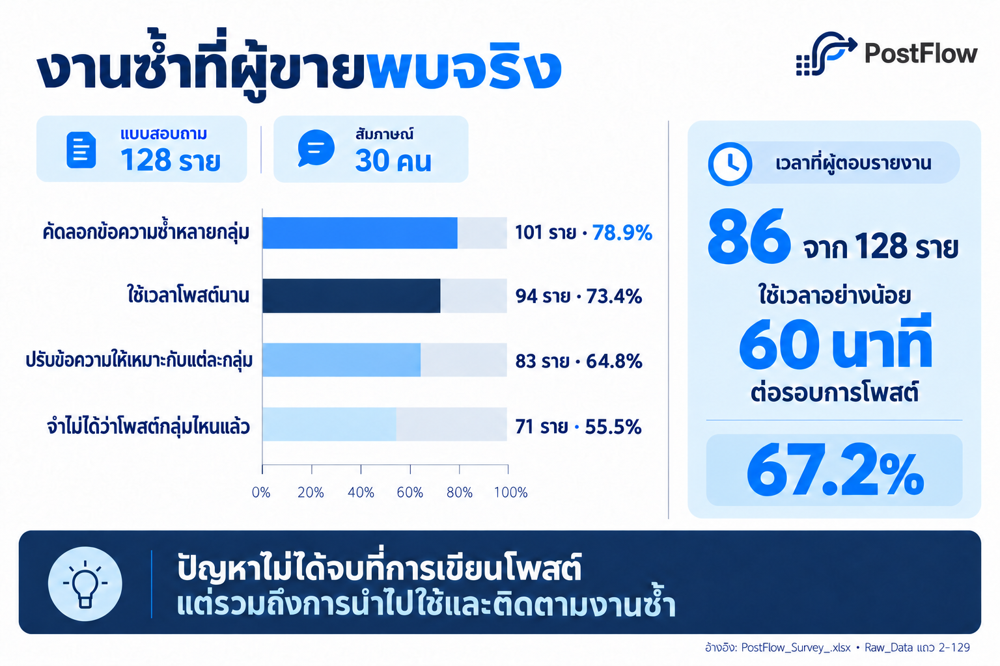
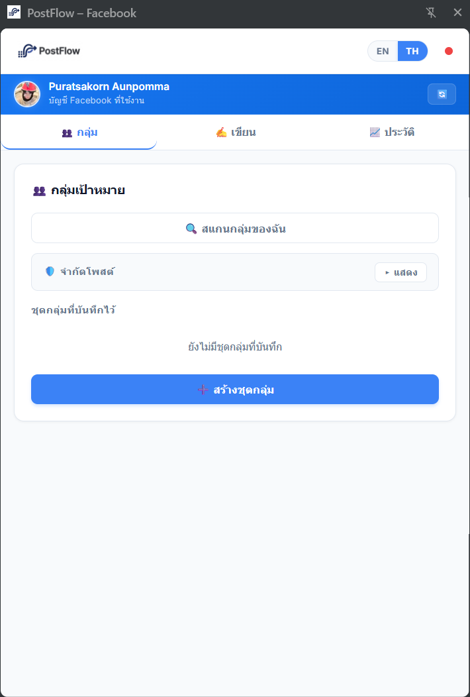
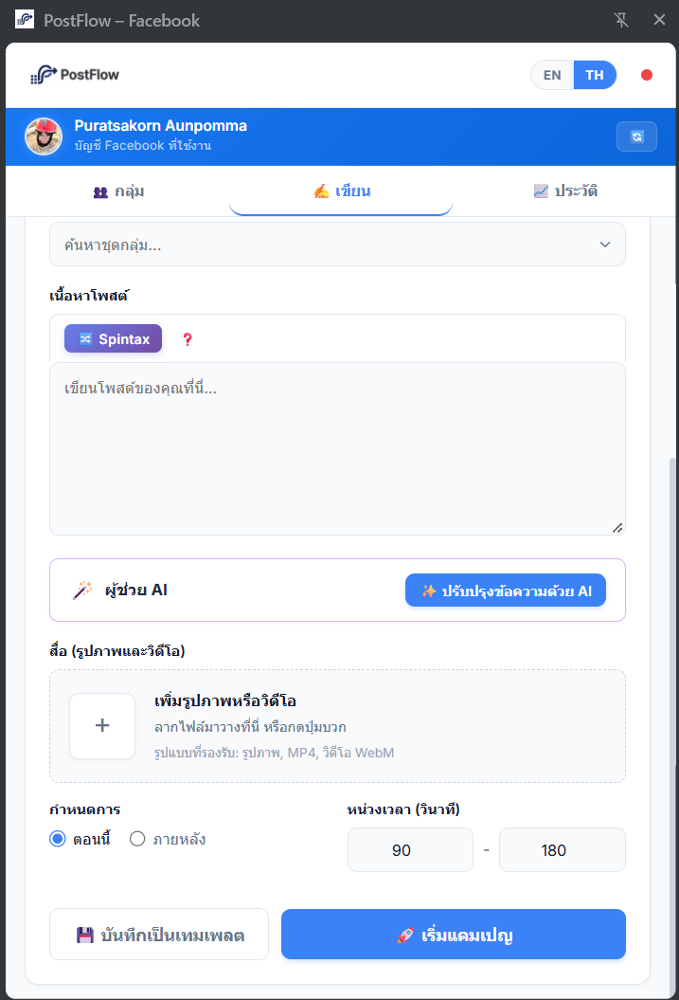
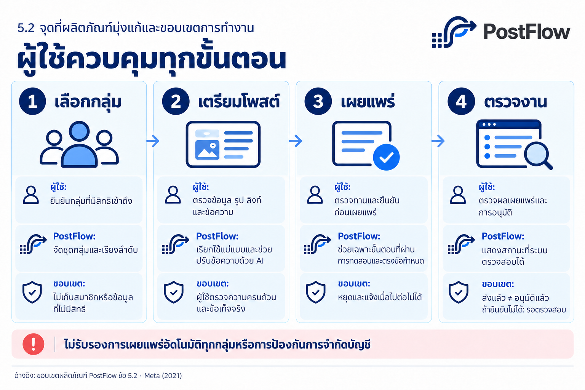
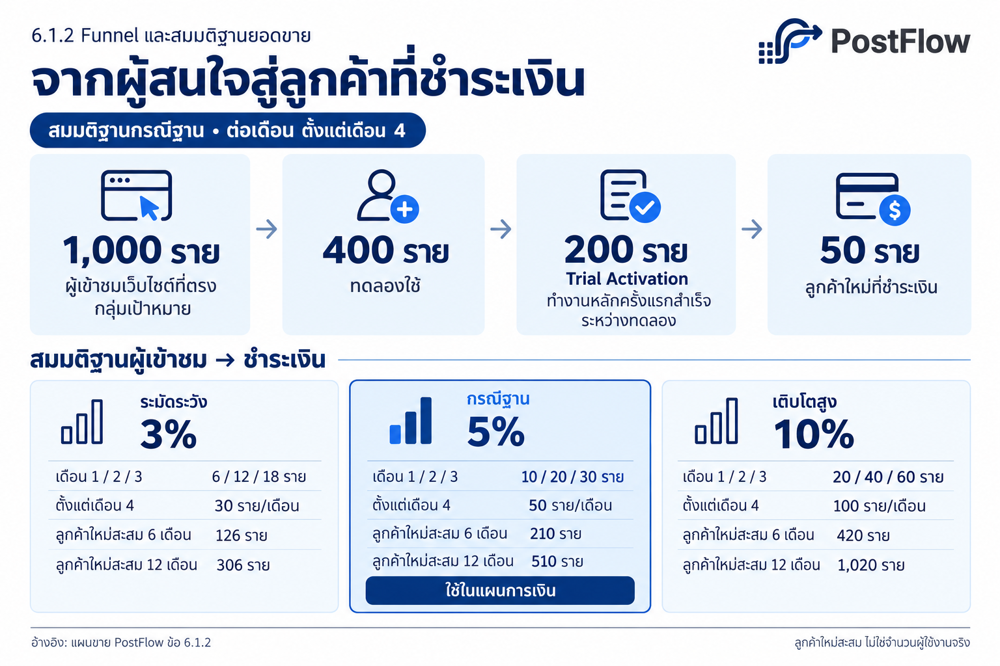
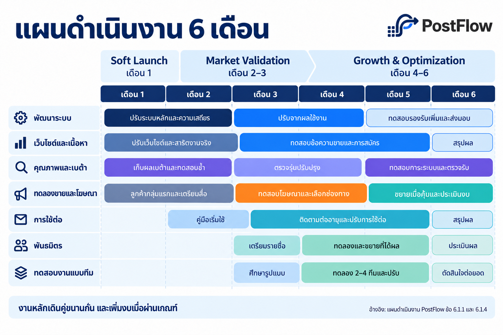
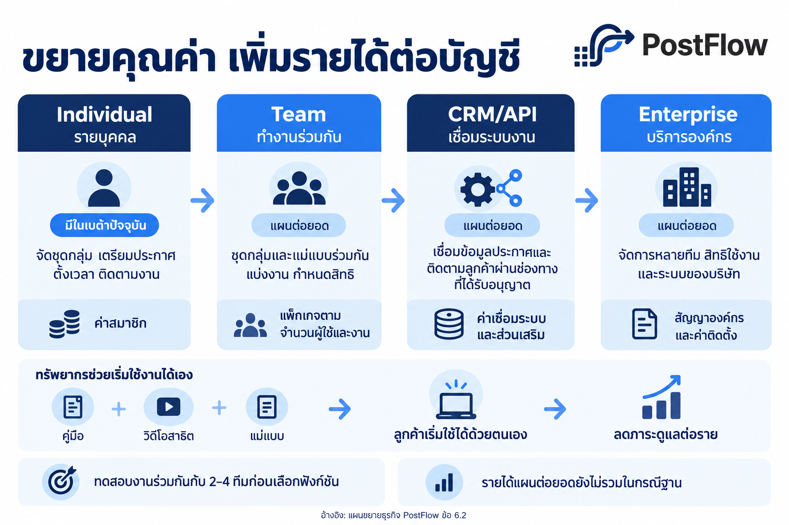
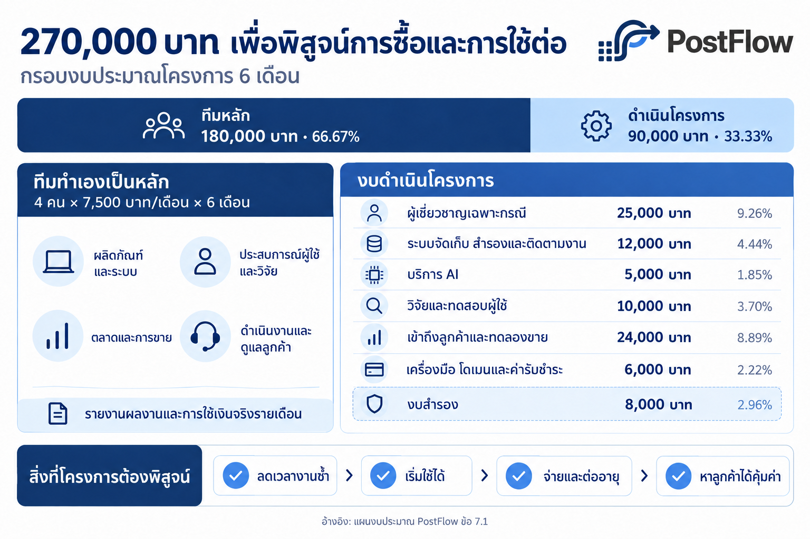
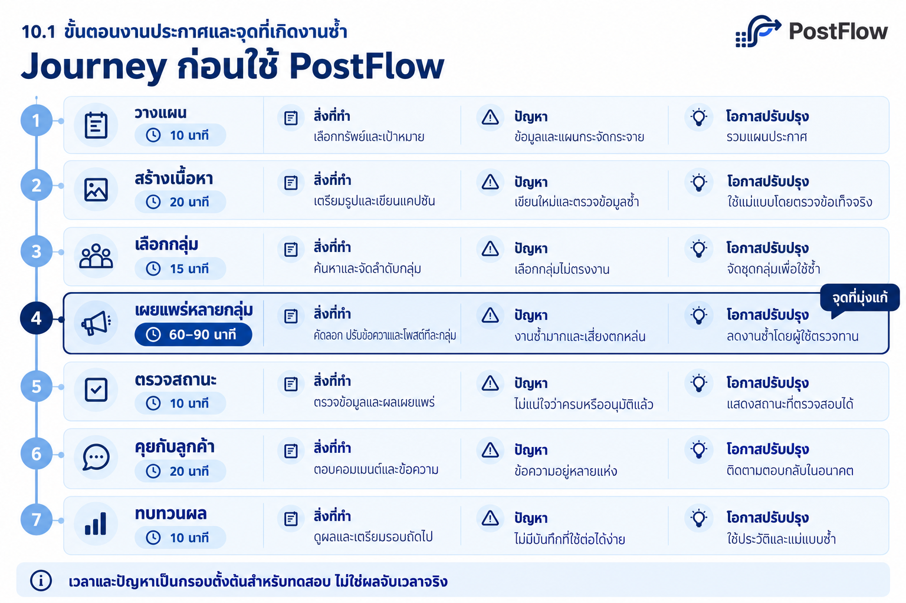

# แผนธุรกิจ PostFlow

ร่างเนื้อหาสำหรับพิจารณาโครงการ | ฉบับ 2.15 (เชื่อมบริบทและข้อมูลผู้ใช้) | 8 ตุลาคม 2569

ระยะดำเนินงาน 6 เดือน | สมาชิก 4 คน | งบโครงการ 270,000 บาท

> **สถานะข้อมูล:** ✓ ปัจจุบัน · △ หลักฐานประกอบ · ○ สมมติฐาน/เป้าทดสอบ

## 1. บทสรุปผู้บริหาร

Facebook เป็นทั้งพื้นที่สื่อสารและช่องทางขายที่ผู้ประกอบการไทยใช้เข้าถึงลูกค้า สำหรับผู้ขายออนไลน์ ร้านค้า SME และผู้ดูแลการตลาด Facebook Groups ช่วยให้ประกาศเข้าถึงชุมชนที่สนใจสินค้าหรือบริการใกล้เคียงกัน แต่เมื่อผู้ขายมีหลายประกาศ ต้องลงหลายกลุ่ม และกลับมาโพสต์หรืออัปเดตซ้ำ งานที่ดูเล็กในแต่ละครั้งจะกลายเป็นภาระที่ต้องจัดการทุกวัน

ทีมสำรวจผู้ขายออนไลน์ เจ้าของแบรนด์ แอดมิน/เอเจนซี และตัวแทนจำหน่ายรวม **128 ราย** พร้อมใช้ข้อมูลจากการสัมภาษณ์ **30 คน** เพื่อทำความเข้าใจขั้นตอนการทำงานเพิ่มเติม ผลสำรวจพบว่า **101 รายระบุปัญหาคัดลอกข้อความซ้ำ** และ **86 รายรายงานว่าใช้เวลาอย่างน้อย 60 นาทีต่อรอบการโพสต์** สะท้อนว่าปัญหาไม่ได้มีเพียงการเขียนคอนเทนต์ แต่รวมถึงการนำประกาศไปใช้ การติดตามสถานะ และการเตรียมงานเดิมซ้ำในแต่ละรอบ

**PostFlow จัดการงานประกาศหลาย Facebook Groups ไว้ในขั้นตอนเดียว** ตั้งแต่จัดชุดกลุ่ม เก็บประกาศและแม่แบบ ปรับข้อความ ตั้งเวลา ไปจนถึงติดตามสถานะแคมเปญ ปัจจุบันมีต้นแบบและเปิดบริการเบต้าแล้ว ผู้ใช้ยังตรวจทานข้อมูล เลือกกลุ่ม และยืนยันก่อนเริ่มงาน คุณค่าที่ต้องการสร้างคือคืนเวลาจากงานซ้ำ ให้ผู้ขายนำไปดูแลลูกค้าและทำงานขายที่สร้างมูลค่ามากกว่า

ธุรกิจใช้รูปแบบรายได้จากค่าสมาชิก โดยใช้ราคาเบื้องต้นสำหรับกลุ่ม Pilot ที่ **490 บาทต่อเดือน** เพื่อนำผลทดลองขายมาพัฒนาราคาและแพ็กเกจให้เหมาะกับลูกค้า แผนขายเริ่มจากผู้ใช้เบต้าและเครือข่ายเพื่อปรับปรุงประสบการณ์ใช้งาน จากนั้นใช้ Facebook, TikTok และเว็บไซต์สนับสนุนการสาธิตและทดลองขาย ก่อนต่อยอดจากการใช้งานรายบุคคลสู่ทีมและองค์กร

โครงการ **4 คน ระยะ 6 เดือน งบ 270,000 บาท** มุ่งพิสูจน์ว่าลูกค้าลดเวลางานซ้ำได้ เริ่มใช้ได้ ยอมจ่ายและต่ออายุ และทีมสามารถหาลูกค้าได้ในต้นทุนที่รองรับการขยาย เงินทุนจึงใช้เปลี่ยนเบต้าที่มีอยู่ให้เป็นบริการที่ขายและดูแลลูกค้าได้จริง แล้วขยายจากวิธีที่ได้ผล ไม่ใช่เพิ่มฟีเจอร์หรือจำนวนโพสต์เพียงอย่างเดียว

## 2. ภาพรวมธุรกิจ

### 2.1 Facebook กับโอกาสของบริการจัดการงานประกาศ

Facebook เป็นหนึ่งในช่องทางหลักที่คนไทยใช้งาน รายงาน Digital 2025 ซึ่ง Meltwater สรุปจากข้อมูล GWI ระบุว่า **90.7% ของผู้ใช้อินเทอร์เน็ตอายุ 16 ปีขึ้นไปในไทยใช้ Facebook และเป็นอันดับ 1 ของแพลตฟอร์มในแบบสำรวจ** (อ้างอิง 1) ขณะที่ผลสำรวจ สพธอ. ปี 2565 พบว่า **66.76% หรือประมาณ 2 ใน 3 ของผู้ขายที่ตอบคำถามช่องทางขายเลือก Facebook/Facebook Page** โดยผู้ตอบเลือกได้หลายช่องทาง (อ้างอิง 7)

เมื่อ Facebook เป็นช่องทางขายที่ใช้อยู่แล้ว ผู้ขายรายย่อยและ SME จึงต้องดูแลทั้งคอนเทนต์ ช่องทางเผยแพร่ และการติดต่อกับลูกค้า โดย Facebook Groups เป็นพื้นที่เข้าถึงคนที่รวมตัวตามความสนใจ ประเภทสินค้า หรือพื้นที่ ผู้ขายที่ใช้หลายกลุ่มต้องจัดการประกาศให้ตรงกับแต่ละกลุ่มและติดตามงานให้ครบ โอกาสของ PostFlow จึงอยู่ที่ **ทำให้งานขายผ่านหลายกลุ่มจัดการได้ง่ายขึ้น** ไม่ใช่สร้างช่องทางขายใหม่ให้ผู้ใช้เริ่มจากศูนย์

PostFlow เป็นบริการจัดการและเผยแพร่ประกาศหลาย Facebook Groups โดยรวมชุดกลุ่ม ข้อความ แม่แบบ ตารางเวลา และประวัติไว้ด้วยกัน ธุรกิจเก็บค่าสมาชิกตามแพ็กเกจ เพื่อให้ผู้ใช้กลับมาใช้กระบวนการเดิมกับประกาศและแคมเปญใหม่ได้ต่อเนื่อง ปัจจุบันให้ทดลองผ่านส่วนเสริม Chrome รายละเอียดความสามารถอยู่ในข้อ 5

## 3. การวิเคราะห์ธุรกิจและตลาด

### 3.1 ข้อมูลจากผู้ใช้: งานซ้ำเกิดขึ้นตรงไหน

เพื่อทำความเข้าใจว่างานซ้ำเกิดขึ้นตรงไหน ทีมจึงสำรวจผู้ที่ใช้งาน Facebook Groups เพื่อขายและทำการตลาด โดยรวบรวมคำตอบจากผู้ตอบแบบสอบถาม **128 ราย** ประกอบด้วยร้านค้าออนไลน์/เจ้าของแบรนด์ 47 ราย พ่อค้าแม่ค้าออนไลน์รายย่อย 39 ราย แอดมิน/เอเจนซี 18 ราย และตัวแทนจำหน่าย/Network 24 ราย พร้อมใช้ข้อมูลจากการสัมภาษณ์ 30 คนประกอบการทำความเข้าใจขั้นตอนการทำงาน

| สิ่งที่ผู้ตอบระบุ | จำนวนจาก 128 ราย | สัดส่วน |
|---|---:|---:|
| คัดลอกข้อความซ้ำหลายกลุ่ม | 101 | 78.9% |
| ใช้เวลาโพสต์นาน | 94 | 73.4% |
| ต้องปรับข้อความให้เหมาะกับแต่ละกลุ่ม | 83 | 64.8% |
| จำไม่ได้ว่าโพสต์กลุ่มไหนแล้ว | 71 | 55.5% |
| ใช้เวลาอย่างน้อย 60 นาทีต่อรอบการโพสต์ | 86 | 67.2% |

*ที่มา: PostFlow_Survey_.xlsx, Raw_Data แถว 2–129*

ผลเหล่านี้ชี้ว่าผู้ใช้ต้องจัดการงานต่อเนื่องมากกว่าการเขียนโพสต์หนึ่งชิ้น: **หลายประกาศ → หลายกลุ่ม → หลายรอบ → ตรวจว่างานใดทำไปแล้ว** เมื่อรายชื่อกลุ่ม ข้อความ และประวัติแยกกัน ผู้ใช้ต้องคัดลอก ปรับ และตามงานเองซ้ำ ๆ ทั้งนี้ ผู้ตอบ 110 รายให้ความสำคัญกับการใช้งานง่าย และ 101 รายต้องการภาษาไทย ทีมจึงออกแบบให้ลดทั้งงานซ้ำและความยุ่งยากในการเริ่มใช้

### 3.2 Persona ตัวอย่าง: ผู้ขายที่ต้องโพสต์ซ้ำเป็นประจำ

○ **ตัวอย่างสมมติเพื่ออธิบายพฤติกรรมผู้ใช้:** เจ้าของร้านออนไลน์คนหนึ่งดูแลหลายสินค้าและลงประกาศในกลุ่มตามประเภทสินค้าหรือพื้นที่ ทุกครั้งที่มีสินค้าใหม่ ราคาเปลี่ยน หรือรายการเดิมต้องประชาสัมพันธ์อีกครั้ง เขาต้องค้นหากลุ่ม เปิดข้อความเดิม ปรับรายละเอียด โพสต์ และบันทึกว่าลงที่ใดไปแล้ว

ระหว่างนั้นยังมีลูกค้ารอคำตอบและงานขายที่ต้องติดตาม หากจัดชุดกลุ่มและเก็บประกาศไว้ใช้ต่อได้ งานรอบใหม่จะเหลือการตรวจและปรับข้อมูล แทนการเตรียมทุกอย่างใหม่ ตัวอย่างนี้สะท้อนคุณค่าของเวลาที่ผู้ขายอาจได้กลับคืนจากการลดงานจัดเตรียมและติดตามประกาศซ้ำ ๆ

### 3.3 SWOT และแนวทางรับมือ

| ด้าน | ประเด็น |
|---|---|
| **จุดแข็ง** | มีเบต้าที่รวมชุดกลุ่ม แม่แบบ การตั้งเวลา และสถานะแคมเปญไว้ในหน้าทำงานภาษาไทย พร้อมนำประกาศเดิมกลับมาใช้ ทีมจึงสามารถสาธิตขั้นตอนการทำงานได้ครบและปรับให้ตรงกับงานจริงของผู้ขายไทยได้ |
| **จุดอ่อน** | ฟังก์ชันหลักใกล้เคียงกับเครื่องมือในตลาด จุดต่างจึงต้องพิสูจน์ผ่านความสะดวกในการเริ่มใช้งาน เวลาที่ลดลง และการกลับมาใช้งาน ไม่ใช่จำนวนฟีเจอร์ |
| **โอกาส** | ผลสำรวจสะท้อนความต้องการเครื่องมือที่ใช้ง่ายและรองรับภาษาไทย ขณะที่งานประกาศซ้ำพบได้ในหลายอาชีพ เปิดโอกาสให้พัฒนาบริการให้ตรงกับงานและขยายจากกลุ่มที่พิสูจน์คุณค่าแล้ว |
| **ภัยคุกคาม** | คู่แข่งที่มีฟังก์ชันใกล้เคียงอาจแข่งขันด้วยราคา ภาษาและบริการ ส่วนการเปลี่ยนข้อกำหนดหรือหน้าจอ Facebook อาจกระทบความต่อเนื่องของผลิตภัณฑ์ |

ทีมจะใช้ผลทดลองกับลูกค้ากลุ่มแรกเพื่อปรับปรุงงานที่สร้างคุณค่า พร้อมติดตามความเสถียรและข้อกำหนดแพลตฟอร์มก่อนเพิ่มงบ

## 4. แผนการบริหารจัดการองค์กร

### 4.1 ทีมและการแบ่งงาน

ทีม 4 คนแบ่งความรับผิดชอบด้านผลิตภัณฑ์ ประสบการณ์ผู้ใช้ ตลาดและการขาย รวมถึงการดำเนินงานและดูแลลูกค้า

| ชื่อ–นามสกุล | รหัสนักศึกษา | บทบาท | งานและสิ่งที่ส่งมอบ |
|---|---|---|---|
| ปุรัสกร อ้วนพรมมา | 673210268-1 | ผลิตภัณฑ์และระบบ | พัฒนาฟังก์ชันหลัก แก้ปัญหาจากผู้ทดลองใช้ และส่งมอบโค้ด ผลการทดสอบ และคู่มือระบบ |
| อภิชญา คุ้มเรือน | 673210293-2 | ประสบการณ์ผู้ใช้และวิจัย | วัดเวลาและความถูกต้อง ทดสอบขั้นตอนเริ่มใช้ และปรับคู่มือกับแม่แบบประกาศ |
| รพินท์นิภา ตั้งศิริเสถียร | 673210592-2 | ตลาดและการขาย | สาธิต ทดลองขาย จัดทำสื่อ ติดตามผู้สนใจ และรายงานผลขายกับต้นทุนหาลูกค้า |
| ปุณณิธิตา วินิจฉัยธรรม | 673210845-9 | การดำเนินงานและดูแลลูกค้า | ช่วยลูกค้าเริ่มใช้งาน ติดตามการชำระและต่ออายุ ดูแลลูกค้า และรายงานค่าใช้จ่าย |

กำหนดบทบาท เวลาทำงาน และผู้รับผิดชอบสำรองก่อนเริ่มโครงการ พร้อมตรวจความคืบหน้ารายสัปดาห์และแยกผู้ตรวจรับออกจากผู้ส่งมอบงาน

### 4.2 ค่าตอบแทนและการทำงานร่วมกัน

**4 คน × 7,500 บาท/เดือน × 6 เดือน = 180,000 บาท** หรือคนละ 45,000 บาท ทีมหลักรับผิดชอบการพัฒนา การทดสอบ การดูแลผู้ใช้และการขาย โดยใช้ผู้เชี่ยวชาญเฉพาะประเด็นที่ทีมไม่ควรประเมินเอง หรือกรณีที่ทีมไม่สามารถแก้ปัญหาทางเทคนิคได้ ค่าตอบแทนจ่ายตามบทบาท ข้อตกลงและกติกาโครงการ พร้อมรายงานผลรายเดือน ค่าตอบแทนเต็มทีมนี้กำหนดเฉพาะ 6 เดือนของโครงการ หลังจากนั้นใช้แผนดูแลบริการและกรอบต้นทุนหลังโครงการตามข้อ 8.1

## 5. ผลิตภัณฑ์และกระบวนการให้บริการ

### 5.1 สถานะและความสามารถของผลิตภัณฑ์

✓ PostFlow นำปัญหาคัดลอกข้อความ ปรับประกาศ และตามสถานะซ้ำ ๆ มาออกแบบเป็นขั้นตอนทำงานเดียว ปัจจุบันเปิดบริการเบต้าให้ผู้ใช้ทดลองผ่านส่วนเสริม Chrome แล้ว โดยความสามารถต่อไปนี้ช่วยนำงานที่เตรียมไว้กลับมาใช้กับการโพสต์แต่ละรอบ

| ความสามารถที่ใช้งานได้ในเบต้า | การทำงานและประโยชน์ต่อผู้ใช้ |
|---|---|
| **จัดกลุ่มเป้าหมาย (Group Sets)** | รวบรวมกลุ่ม Facebook ที่ผู้ใช้มีสิทธิเข้าถึงและจัดเป็นชุดสำหรับแต่ละงานหรือแคมเปญ ลดการค้นหาและเลือกกลุ่มใหม่ทุกครั้ง |
| **Spintax สำหรับข้อความหลายรูปแบบ** | สร้างข้อความหลายรูปแบบจากประกาศต้นฉบับเดียว โดยใช้ตัวเลือกคำที่ผู้ใช้กำหนด ลดการแก้ข้อความด้วยตนเองทีละกลุ่ม |
| **ผู้ช่วยปรับข้อความด้วย AI** | ช่วยปรับสำนวนและสร้างตัวเลือกข้อความจากข้อมูลที่ผู้ใช้ให้ โดยผู้ใช้ยังตรวจทานก่อนนำไปใช้ |
| **กำหนดจังหวะและข้อจำกัดของการเผยแพร่** | กำหนดช่วงเวลาระหว่างงาน เพดานการทำงานรายวันหรือรายสัปดาห์ และหยุดแคมเปญเมื่อเกิดข้อผิดพลาดต่อเนื่อง เพื่อลดการทำงานผิดพลาดและให้ผู้ใช้ควบคุมปริมาณงาน |
| **ตั้งเวลาแคมเปญหลายช่วง** | วางแผนการเผยแพร่หลายช่วงเวลาในแคมเปญเดียว เช่น รอบเช้า บ่าย และค่ำ โดยไม่ต้องสร้างงานใหม่ทุกครั้ง |
| **คลังแม่แบบประกาศ** | บันทึกประกาศเดิมเพื่อนำกลับมาแก้ไขหรือใช้ซ้ำกับแคมเปญใหม่ ลดการเตรียมงานจากศูนย์ |
| **ติดตามสถานะแคมเปญและจัดการโพสต์** | แสดงสถานะที่ระบบตรวจสอบได้ เช่น ส่งแล้ว รอการอนุมัติ หรือเกิดข้อผิดพลาด และรองรับการจัดการโพสต์ที่ระบบสามารถระบุและผู้ใช้มีสิทธิดำเนินการ |

ผู้ใช้ยังเป็นผู้ตรวจทานข้อมูล เลือกกลุ่ม และยืนยันก่อนเริ่มแคมเปญ PostFlow แยกสถานะ **“ส่งโพสต์แล้ว”** ออกจาก **“แอดมินอนุมัติแล้ว”** อย่างชัดเจน และไม่ถือว่าการกำหนดช่วงเวลา จำกัดปริมาณงาน หรือสร้างข้อความหลายรูปแบบเป็นการรับรองว่าจะป้องกันการจำกัดบัญชีได้

ทีมใช้ผลจากเบต้าเพื่อ **ปรับปรุง → ทดสอบซ้ำ → ติดตามผล** โดยวัดทั้งเวลา ความถูกต้อง ความเสถียร และการกลับมาใช้งาน

*ภาพที่ 1 หน้าจัดกลุ่มเป้าหมายในเบต้า PostFlow แสดงส่วนสแกนกลุ่มที่ผู้ใช้เข้าร่วม สร้างชุดกลุ่ม และตั้งข้อจำกัดการโพสต์*

*ภาพที่ 2 หน้าสร้างแคมเปญในเบต้า PostFlow แสดงส่วนเลือกชุดกลุ่ม เตรียมข้อความด้วย Spintax/AI เพิ่มสื่อ กำหนดเวลา และเริ่มแคมเปญ*

### 5.2 จุดที่ผลิตภัณฑ์มุ่งแก้และขอบเขตการทำงาน

งานที่มุ่งลดคือการคัดลอก ปรับข้อความ เลือกกลุ่มและตรวจสถานะซ้ำ ตัวอย่าง Journey ในภาคผนวก 10.1 ใช้เป็นกรอบเปรียบเทียบเวลาและความถูกต้องระหว่างวิธีเดิมกับ PostFlow

PostFlow ใช้แนวทาง **ผู้ใช้ควบคุมขั้นตอนการทำงาน**: ตรวจข้อมูลและยืนยันก่อนเผยแพร่ ไม่ออกแบบเพื่อหลบระบบตรวจจับหรือข้ามมาตรการของแพลตฟอร์ม (อ้างอิง 5)

| ขั้นตอน | ผู้ใช้ทำ | PostFlow ช่วย | ข้อจำกัด |
|---|---|---|---|
| เลือกกลุ่ม | ยืนยันกลุ่มที่มีสิทธิเข้าถึง | จัดชุดกลุ่มและเรียงลำดับ | ไม่เก็บสมาชิกหรือข้อมูลที่ไม่มีสิทธิ |
| เตรียมโพสต์ | ตรวจข้อมูล รูป ลิงก์และข้อความ | เรียกใช้แม่แบบและช่วยปรับข้อความด้วย AI | ผู้ใช้ตรวจความครบถ้วนและข้อเท็จจริงก่อนนำไปใช้ |
| เผยแพร่ | ตรวจทานและยืนยันก่อนเผยแพร่ | ช่วยเฉพาะขั้นตอนที่ผ่านการทดสอบและตรงข้อกำหนด | หยุดและแจ้งเมื่อไปต่อไม่ได้ ไม่รับรองว่าสามารถเผยแพร่ได้อัตโนมัติในทุกกลุ่มหรือป้องกันการจำกัดบัญชีได้ |
| ตรวจงาน | ตรวจผลเผยแพร่และการอนุมัติ | แสดงสถานะที่ระบบตรวจสอบได้ | แยก “ส่งแล้ว” จาก “อนุมัติแล้ว”; ถ้ายืนยันไม่ได้ให้แสดง “รอตรวจสอบ” |

### 5.3 ทางเลือกในตลาดและจุดต่างของ PostFlow

ลูกค้ามีทั้ง Facebook เครื่องมือช่วยเขียน และเครื่องมือโพสต์หลายกลุ่มให้เลือก PostFlow จึงเสนอคุณค่าจาก **การจัดการงานประกาศอย่างต่อเนื่อง ตั้งแต่เตรียมข้อมูลจนถึงตรวจสถานะ** ไม่ใช่เพียงร่างข้อความหรือเพิ่มจำนวนโพสต์

| ทางเลือกที่ลูกค้ามี | สิ่งที่ทำได้อยู่แล้ว | จุดต่างที่ PostFlow มุ่งพิสูจน์ |
|---|---|---|
| **Facebook และเครื่องมือแยก** | ผู้ใช้เตรียมข้อความ รายชื่อกลุ่ม และบันทึกการโพสต์แยกกัน | เก็บชุดกลุ่ม ประกาศและประวัติไว้ด้วยกัน เพื่อเริ่มงานรอบถัดไปจากข้อมูลเดิมแทนการเตรียมใหม่ |
| **ChatGPT** | ช่วยร่างและปรับข้อความ รวมถึงเชื่อมเครื่องมือเพิ่มเติมได้ | มีขั้นตอนสำหรับ Facebook Groups พร้อมใช้งาน ตั้งแต่เลือกชุดกลุ่ม วางแผนเผยแพร่ ไปจนถึงติดตามสถานะ โดยไม่ต้องออกแบบการเชื่อมงานเอง |
| **PilotPoster, MultiGroupPoster และ Group Posting** | มีเครื่องมือโพสต์หลายกลุ่ม ตั้งเวลา และนำข้อความกลับมาใช้ โดยรายละเอียดต่างกันตามบริการ | มุ่งสร้างประสบการณ์สำหรับผู้ขายไทย ผ่านหน้าทำงานภาษาไทย แม่แบบตามลักษณะงาน และการช่วยตั้งชุดกลุ่มกับแคมเปญแรก แล้วพิสูจน์ว่าลูกค้าเริ่มใช้ได้ ลดเวลา และกลับมาใช้ต่อ |

ความสามารถของทางเลือกอ้างอิงจากข้อมูลผู้ให้บริการ (อ้างอิง 2–4 และ 8) เกณฑ์ที่ PostFlow จะใช้ประเมินจุดต่างคือ **ลูกค้าทำงานได้ง่ายขึ้น ใช้เวลาน้อยลง และอยากกลับมาใช้ต่อ** โดยวัดกับงานจริงและวิธีเดิมของลูกค้า ไม่ตัดสินจากจำนวนฟีเจอร์เพียงอย่างเดียว

## 6. แผนการตลาดและแผนการขาย

### 6.1 แผนเข้าสู่ตลาด 6 เดือน (Go-to-Market)

**เลือกกลุ่มแรก → เข้าถึงผู้ขายที่โพสต์หลายกลุ่มเป็นประจำ → สาธิตงานจริง → ช่วยเริ่มใช้งาน → วัดการซื้อและใช้ต่อ → ขยายช่องทางที่ได้ผล**

**กลุ่ม Pilot แรก:** เลือกนายหน้าอสังหาริมทรัพย์อิสระและทีมเล็กที่ดูแลหลายทรัพย์ ลงประมาณ 10 Facebook Groups ขึ้นไปต่อทรัพย์ และโพสต์หรืออัปเดตเป็นประจำ งานลักษณะนี้ทำให้สาธิตปัญหาและเปรียบเทียบเวลาที่ใช้ได้ชัดเจน การเลือกกลุ่มเดียวก่อนช่วยให้ทีมปรับเดโม แม่แบบ และการช่วยเริ่มใช้ให้ตรงงาน

ทีมเริ่มจากผู้ใช้เบต้า เครือข่ายและชุมชนที่เกี่ยวข้อง พร้อมเปิดรับผู้สนใจผ่านเว็บไซต์ [PostFlow](https://www.postflows.net/) สาธิตด้วยประกาศจริง ช่วยตั้งชุดกลุ่มและทำโพสต์แรก แล้วติดตามการซื้อ การใช้ซ้ำ การต่ออายุ และเวลาที่ทีมดูแลแต่ละราย โดยนับลูกค้าไม่ซ้ำและตรวจความยินยอมก่อนติดต่อ ราคาเบื้องต้นสำหรับ Pilot คือ 490 บาทต่อเดือน โดยนำผลการซื้อและการใช้ต่อมาพิจารณาราคาและแพ็กเกจก่อนขยายตลาด

#### 6.1.1 แผน 3 ระยะ

| ระยะ | ช่วงเวลา | กิจกรรมหลักและเป้าลูกค้าใหม่กรณีฐาน |
|---|---|---|
| **1. Soft Launch — ทดลองขายและปรับจากผู้ใช้** | เดือน 1 | แก้จุดติดขัดจากเบต้า ปรับเว็บไซต์และเดโม ทดลองขายกับกลุ่มลูกค้าขนาดเล็กเมื่อพร้อม ลูกค้าใหม่ 10 ราย |
| **2. Market Validation — พิสูจน์การซื้อและการใช้ต่อ** | เดือน 2–3 | ช่วยลูกค้าเริ่มใช้ ติดตามการต่ออายุ ทดสอบข้อความขายและโฆษณา ลูกค้าใหม่ 20 และ 30 รายตามลำดับ |
| **3. Growth & Optimization — ขยายเฉพาะสิ่งที่ได้ผล** | เดือน 4–6 | ขยายเนื้อหา เครือข่ายและการแนะนำต่อที่ได้ผล ลดเวลาที่ทีมดูแลแต่ละราย และเพิ่มงบเมื่อผ่านเกณฑ์ ลูกค้าใหม่ 50 รายต่อเดือน |

#### 6.1.2 Funnel และสมมติฐานยอดขาย

**Funnel กรณีฐาน:** ตั้งแต่เดือน 4 ผู้เข้าชมเว็บไซต์ที่ตรงกลุ่มเป้าหมาย 1,000 ราย → ทดลองใช้ 400 ราย → Trial Activation 200 ราย → ลูกค้าที่ชำระเงิน 50 ราย แล้วเทียบอัตราซื้อ 3 กรณี

| กรณี | ผู้เข้าชม → ชำระเงิน | ลูกค้าใหม่เดือน 1 / 2 / 3 | ลูกค้าใหม่ต่อเดือน ตั้งแต่เดือน 4 | สะสม 6 / 12 เดือน |
|---|---:|---:|---:|---:|
| ระมัดระวัง | 3% | 6 / 12 / 18 | 30 | 126 / 306 |
| **ฐาน — ใช้ในแผนการเงิน** | **5%** | **10 / 20 / 30** | **50** | **210 / 510** |
| เติบโตสูง | 10% | 20 / 40 / 60 | 100 | 420 / 1,020 |

#### 6.1.3 ช่องทางและต้นทุนหาลูกค้า

Facebook ใช้เข้าถึงนายหน้าและชุมชนที่เกี่ยวข้อง TikTok ใช้สาธิตการทำงาน ส่วนเครือข่ายช่วยพาผู้ใช้กลุ่มแรกเข้ามา เว็บไซต์เป็นจุดรวมเดโม การทดลองใช้ และการเลือกแพ็กเกจ ช่องทางเหล่านี้สนับสนุนวิธีขายเดียวกัน โดยยังยึดกลยุทธ์เลือกกลุ่มลูกค้าเป็นหลัก

กรณีฐานได้ลูกค้าใหม่รวม 210 รายใน 6 เดือน งบตลาด 24,000 บาทให้ **CAC เฉพาะเงินตลาดประมาณ 114 บาท/ราย** เมื่อรวมแรงงานตลาดและขายที่จัดสรร 30,000 บาท จะเป็น **CAC ประมาณ 257 บาท/ราย ยังสูงกว่าเกณฑ์ก่อนขยายที่ไม่เกิน 200 บาท/ราย**

| ช่องทาง | สัดส่วนลูกค้าใหม่กรณีฐาน |
|---|---:|
| Facebook/Meta | 40% |
| TikTok | 40% |
| เครือข่าย/การแนะนำต่อ | 20% |
| **รวม** | **100%** |

**สัดส่วนงบตลาด:** โฆษณาหาคนใหม่ 45% · Retargeting 15% · เครือข่ายและการติดต่อโดยตรง 25% · สื่อสาธิตและเนื้อหา 15% เปิด Retargeting เมื่อฐานผู้ชมและระบบวัดผลพร้อม

ต้นทุนแรงงานด้านตลาดและการขาย 30,000 บาทจัดสรรจากค่าทีม 180,000 บาทตามแผนเวลางานตลอด 6 เดือน ไม่บวกซ้ำในกระแสเงินสด และปรับตามเวลาทำงานจริง

#### 6.1.4 แผนดำเนินงาน 6 เดือน

| งาน | เดือน 1 | เดือน 2 | เดือน 3 | เดือน 4 | เดือน 5 | เดือน 6 |
|---|---|---|---|---|---|---|
| พัฒนาฟังก์ชันหลัก | ปรับระบบหลัก | เพิ่มความเสถียร | ปรับจากผลการใช้งาน | ปรับจากผลการใช้งาน | ทดสอบการรองรับงานเพิ่ม | ส่งมอบระบบ |
| การตลาดและการเปลี่ยนผู้สนใจเป็นลูกค้า | ปรับหน้าแนะนำและติดต่อเครือข่ายเดิม | ปรับเว็บไซต์จากข้อมูลการซื้อและทำสื่อสาธิต | ทดสอบข้อความขายและทำเนื้อหาต่อเนื่อง | ปรับการสมัครและขยายการแนะนำต่อ | ปรับการสมัครและขยายการแนะนำต่อ | สรุปผลและต้นทุน |
| ทดสอบคุณภาพและเบต้า | เก็บผลเบต้า | ทดสอบซ้ำ | ตรวจรุ่นปรับปรุง | ตรวจรุ่นปรับปรุง | ทดสอบภาระระบบ | ตรวจรับ |
| ทดลองขายและโฆษณา | ขายกับกลุ่มเล็กเมื่อพร้อม | ดูแลลูกค้ากลุ่มแรกและเตรียมสื่อโฆษณา | ติดตามผลขายและทดสอบโฆษณา | เลือกช่องทางที่ได้ผล | ขยายเมื่อคุ้ม | ประเมินงบ |
| อีเมลและการใช้ต่อ | — | คู่มือเริ่มใช้ | ติดตามการต่ออายุ | ติดตามการต่ออายุ | ปรับเพื่อเพิ่มการใช้ต่อ | สรุปผล |
| พันธมิตร | — | — | เตรียมรายชื่อ | ทดลองพันธมิตร | ขยายที่ได้ผล | ประเมินผล |
| ฟีเจอร์รองรับการขยาย | — | — | ศึกษาการใช้งานแบบทีม | ทดลอง 2–4 ทีม | ปรับจากผลทดลอง | ตัดสินใจต่อยอด |

### 6.2 การขยายธุรกิจ (Scalability)

PostFlow มีเส้นทางต่อยอดจากการจัดการประกาศรายบุคคล สู่การทำงานร่วมกันของทีมและองค์กร เส้นทางขยายคือ **Individual → Team → CRM/API → Enterprise** โดยใช้ระบบหลักเดิมเป็นฐาน ไม่สร้างบริการใหม่จากศูนย์ทุกครั้ง

| ระดับบริการ | คุณค่าที่ลูกค้าได้รับ | โอกาสเพิ่มรายได้ |
|---|---|---|
| **Individual — ใช้งานรายบุคคล** | จัดชุดกลุ่ม เตรียมประกาศ ตั้งเวลา และติดตามงานของตนเอง; มีในเบต้าปัจจุบัน | ค่าสมาชิก และเพิ่มลูกค้าด้วยเดโม แม่แบบและคู่มือที่ใช้ซ้ำได้ |
| **Team — ทำงานร่วมกัน** | แผนต่อยอดให้ทีมใช้ชุดกลุ่มและแม่แบบร่วมกัน แบ่งงาน กำหนดสิทธิ และเห็นประวัติรวม | แพ็กเกจทีมตามจำนวนผู้ใช้และขอบเขตงาน ช่วยเพิ่มรายได้ต่อบัญชี |
| **CRM/API — เชื่อมกับระบบงาน** | แผนต่อยอดเชื่อมข้อมูลประกาศและงานติดตามลูกค้ากับ CRM ผ่านช่องทางที่ได้รับอนุญาต ลดการกรอกข้อมูลซ้ำ | ค่าบริการเชื่อมระบบและส่วนเสริมตามความต้องการ |
| **Enterprise — บริการองค์กร** | แผนต่อยอดการจัดการหลายทีม สิทธิใช้งาน และการเชื่อมระบบของบริษัท | สัญญาบริการระดับองค์กรและค่าติดตั้งตามขอบเขตที่ตกลง |

การขยายจะเริ่มจากทำให้ลูกค้าเริ่มใช้ได้โดยไม่ต้องพึ่งทีมทุกขั้นตอน ผ่านคู่มือ วิดีโอสาธิต และแม่แบบตามลักษณะงาน ทีมช่วยเฉพาะจุดที่ลูกค้าติดขัดและติดตามเวลาที่ใช้ดูแลต่อราย เพื่อให้จำนวนลูกค้าเพิ่มได้โดยไม่เพิ่มภาระทีมในสัดส่วนเดียวกัน ระหว่างโครงการจะทดสอบรูปแบบงานร่วมกันกับ **2–4 ทีม** เพื่อเลือกฟังก์ชันที่ควรพัฒนาก่อนเปิดขายแพ็กเกจทีม จากนั้นจึงขยายกลุ่มเดิมหรือเลือกกลุ่มอาชีพถัดไปทีละกลุ่ม

**Team, CRM/API และ Enterprise เป็นแผนต่อยอด ไม่ใช่ความสามารถเบต้าปัจจุบัน** การพัฒนาจะพิจารณาจากผลการซื้อและการใช้งานต่อ ต้นทุนบริการ และข้อกำหนดแพลตฟอร์ม รายได้จากบริการเหล่านี้ยังไม่รวมในแบบจำลองกรณีฐาน

## 7. แผนงบประมาณโครงการ

### 7.1 กรอบงบประมาณตลอด 6 เดือน

○ **งบโครงการ 270,000 บาท** แบ่งเป็นค่าตอบแทนทีม 180,000 บาท และงบดำเนินโครงการ 90,000 บาท โดยจ่ายตามงานจริง

| รายการ | บาท | สัดส่วนโดยประมาณ | วัตถุประสงค์การใช้จ่าย |
|---|---:|---:|---|
| ค่าตอบแทนทีม 4 คน × 7,500 บาท/เดือน × 6 เดือน | 180,000 | 66.67% | พัฒนาระบบ วิจัยผู้ใช้ ทดลองขายและดูแลบริการ |
| ผู้เชี่ยวชาญเฉพาะกรณี | 25,000 | 9.26% | ตรวจประเด็นสำคัญและแก้เทคนิคเมื่อจำเป็น |
| ระบบจัดเก็บข้อมูล สำรองข้อมูล และติดตามการทำงาน | 12,000 | 4.44% | ใช้ตามปริมาณงาน ไม่เตรียมระบบเผื่อขยายเกินจำเป็น |
| บริการ AI | 5,000 | 1.85% | สนับสนุนการเตรียมข้อความ โดยกำหนดขอบเขตและติดตามปริมาณการใช้งาน |
| วิจัยและทดสอบผู้ใช้ | 10,000 | 3.70% | เก็บเวลา ความถูกต้องและผลทดลอง |
| เข้าถึงลูกค้าและทดลองขาย | 24,000 | 8.89% | พิสูจน์การซื้อและต้นทุนหาลูกค้าจริง |
| เครื่องมือ โดเมน การเผยแพร่ระบบและค่าธรรมเนียมรับชำระ | 6,000 | 2.22% | เครื่องมือจำเป็นและค่าธรรมเนียม |
| งบสำรอง | 8,000 | 2.96% | รองรับค่าใช้จ่ายจำเป็นที่ไม่ได้คาดไว้ โดยต้องได้รับอนุมัติก่อนใช้ |
| **รวมงบโครงการ** | **270,000** | **100.00%** | **รายการหลัก 262,000 บาท + งบสำรอง 8,000 บาท** |

ค่าตอบแทนคนละ 45,000 บาทตลอด 6 เดือนรองรับงานและผลส่งมอบทั้งสี่บทบาทในข้อ 4.1 ทีมรายงานผลงานและการใช้เงินจริงรายเดือน

ทีมทำเองเป็นหลัก กันงบผู้เชี่ยวชาญภายนอก **ไม่เกิน 25,000 บาท** ใช้เฉพาะการตรวจสอบหรือแก้ปัญหาที่ทีมดำเนินการเองไม่ได้ โดยกำหนดขอบเขตและราคาของแต่ละงานก่อนอนุมัติ จ่ายหลังตรวจรับและไม่จ้างงานที่ซ้ำกับหน้าที่ของทีม

*รายการงบประมาณเป็นประมาณการเบื้องต้นและอาจปรับตามขอบเขตงาน ต้นทุนจริง และบริบทระหว่างดำเนินโครงการ โดยการเปลี่ยนแปลงงบประมาณต้องได้รับการพิจารณาและอนุมัติก่อนดำเนินการ*

## 8. แผนรายได้และความเป็นไปได้ทางการเงิน

**การอ่านแบบจำลอง:** ตัวเลขแผนขายและการเงินใช้วางแผนจากราคา Pilot และสมมติฐานกรณีฐาน เดือน 1 หมายถึงเดือนแรกที่เริ่มขาย หากเปิดขายช้ากว่าแผน ระยะคืนทุนจะเลื่อนตาม รายได้จากบริการต่อยอดยังไม่รวมในประมาณการนี้

*ราคา แพ็กเกจ และประมาณการการเงินอาจปรับในอนาคตตามผล Pilot ต้นทุน และรูปแบบบริการ โดยแจ้งราคาและเงื่อนไขให้ลูกค้าทราบก่อนสมัครหรือเปลี่ยนแพ็กเกจ*

### 8.1 รายได้และต้นทุน

○ แบบจำลองใช้ราคาเบื้องต้นสำหรับ Pilot ที่ **490 บาท/เดือน, 1,290 บาท/3 เดือน และ 4,290 บาท/ปี** กรณีฐานได้ลูกค้าใหม่ 10 → 20 → 30 → 50 รายในเดือน 1–4 แล้ว 50 รายต่อเดือน ใช้สัดส่วนแพ็กเกจ 90%/8%/2% และสมมติฐานต่ออายุรายเดือน **60% ต่อรอบ** ส่วน 75% ใช้เป็นกรณีต่ออายุสูง

กรณีฐานให้ **Revenue LTV ประมาณ 1,292 บาท/ราย** หมายถึงรายได้ตลอดช่วงที่ลูกค้าใช้บริการ ไม่ใช่เงินรับทันทีหรือกำไร สูตรและผลของการต่ออายุอยู่ในข้อ 8.3 ไม่รวมรายได้จากแพ็กเกจทีมในอนาคต

ต้นทุนรวมครอบคลุมค่าหาลูกค้า (CAC) ระบบ การให้บริการและบุคลากรที่จำเป็น ในช่วง 6 เดือนแรก ใช้รายจ่ายตามงวดงบโครงการเป็นฐาน และไม่ประเมินต้นทุนต่ำกว่า **50% ของเงินรับ** หลังสิ้นสุดโครงการใช้ต้นทุนดำเนินงานขั้นต่ำ **20,000 บาทต่อเดือน หรือ 50% ของเงินรับ แล้วแต่จำนวนใดสูงกว่า** เพื่อไม่ประเมินต้นทุนต่ำเกินจริง โดยไม่หักงบโครงการซ้ำ และทบทวนจากต้นทุนจริงก่อนสิ้นสุดโครงการ

### 8.2 ระยะคืนทุน

○ ภายใต้สมมติฐานกรณีฐานที่ต่ออายุ 60% คาดคืนค่าใช้จ่ายโครงการประมาณ **เดือน 10 นับจากเริ่มขาย** ส่วนกรณีต่ออายุ 75% ประมาณเดือน 8 เมื่อหักค่าใช้จ่ายและกันเงินรับล่วงหน้าที่ยังต้องให้บริการทั้งหมดแล้ว กระแสเงินสดรายเดือนอยู่ภาคผนวก 10.2 และผลของการต่ออายุอยู่ในข้อ 8.3

ยอดคงเหลือในแบบจำลองเป็นกระแสเงินสดสุทธิหลังค่าใช้จ่าย ไม่ใช่กำไรสุทธิ ผลนี้ยังไม่รวมภาษีและค่าใช้จ่ายนอกแบบจำลอง ทีมจะตรวจยอดซื้อ การต่ออายุและต้นทุนจริงทุกเดือนก่อนเพิ่มงบ

### 8.3 LTV และผลของการต่ออายุ

○ รายได้ตลอดอายุ (Revenue LTV) หมายถึงรายได้ตลอดช่วงที่ลูกค้าใช้บริการ (อ้างอิง 6) กรณีฐานสมมติการต่ออายุแพ็กเกจรายเดือน 60% ต่อรอบ คำนวณได้เป็น `90% × 490 ÷ (1−60%) + 8% × 1,290 + 2% × 4,290 = 1,291.50 บาท/ราย` หรือประมาณ 1,292 บาท เงินแพ็กเกจยาวรับต้นรอบ แต่ทยอยรับรู้รายได้ตามระยะบริการ

| สมมติฐานต่ออายุรายเดือนต่อรอบ | LTV รายได้โดยประมาณ | ระยะคืนทุนโดยประมาณ |
|---|---:|---:|
| 45% — กรณีต่ออายุต่ำ | 991 บาท/ราย | เดือน 11 |
| **60% — กรณีฐาน** | **1,292 บาท/ราย** | **เดือน 10** |
| 75% — กรณีต่ออายุสูง | 1,953 บาท/ราย | เดือน 8 |

ระยะคืนทุนนับจากเริ่มขาย ทั้งสามกรณีเปลี่ยนเฉพาะอัตราต่ออายุ ใช้จำนวนลูกค้าใหม่และกติกาคิดต้นทุนเดียวกัน ไม่ใช่กรณีเปลี่ยนอัตราซื้อในข้อ 6.1 ตัวเลขทั้งหมดเป็นสมมติฐาน ไม่ใช่ผลจริง

## 9. เกณฑ์ตัดสินใจและแผนรับมือ

○ ทีมจะทบทวนตัวชี้วัดต่อไปนี้ทุกเดือน ใช้เป็นเกณฑ์ก่อนเพิ่มงบหรือขยายบริการ และสรุปผลโครงการเมื่อครบ 6 เดือนเพื่อตัดสินใจเดินหน้า ปรับ หรือหยุด

| เกณฑ์เดินหน้า | สิ่งที่ต้องผ่าน | การรับมือเมื่อไม่ผ่าน |
|---|---|---|
| **ลดเวลางานซ้ำ** | ลดเวลาอย่างน้อย 30% โดยรักษาความถูกต้อง | แก้ฟังก์ชันและวิธีตรวจข้อมูลก่อนขายเพิ่ม |
| **Paid Activation** | ลูกค้าที่ชำระเงินอย่างน้อย 50% ทำงานหลักครั้งแรกครบใน 7 วัน | ชะลอโฆษณา ปรับขั้นตอนเริ่มใช้และคู่มือ |
| **การต่ออายุครั้งแรก** | อย่างน้อย 60% ของรายเดือนที่ครบกำหนด | แก้สาเหตุเลิกใช้ก่อนเพิ่มฟีเจอร์หรือเปิดแพ็กเกจทีม |
| **CAC รวมแรงงาน** | ไม่เกิน 200 บาทต่อราย | หยุดเพิ่มงบช่องทางที่ไม่คุ้ม ปรับข้อความขายและการแนะนำต่อ |
| **ข้อกำหนดแพลตฟอร์ม** | ฟังก์ชันหลักสามารถใช้งานได้โดยไม่ขัดต่อข้อกำหนดของแพลตฟอร์มที่เกี่ยวข้อง | หยุดหรือปรับฟังก์ชันที่มีความเสี่ยงก่อนเปิดให้ใช้งานต่อ |

**Trial Activation** หมายถึงผู้ทดลองใช้ที่ทำงานหลักครั้งแรกสำเร็จระหว่างช่วงทดลอง ส่วน **Paid Activation** หมายถึงลูกค้าที่ชำระเงินแล้วและทำงานหลักครั้งแรกสำเร็จภายใน 7 วัน งานหลักคือเลือกกลุ่ม เตรียมประกาศและทำขั้นเผยแพร่แรกครบตามขอบเขตบริการ การต่ออายุนับเฉพาะลูกค้ารายเดือนที่ครบกำหนด

**Go:** ตัวชี้วัดหลักอยู่ในระดับที่รองรับการขยายตามเกณฑ์ในตาราง และไม่มีความเสี่ยงสำคัญ จึงขยายช่องทางหรือเพิ่มงบเฉพาะในระดับที่ระบบและทีมรองรับได้

**Pivot:** มีตัวชี้วัดหลักไม่ผ่าน ให้ปรับและทดสอบซ้ำก่อนเพิ่มงบหรือเปิดขายแพ็กเกจทีม

**Stop:** หากปรับแล้วแต่ยังพิสูจน์คุณค่าไม่ได้ หรือมีความเสี่ยงที่ไม่สามารถแก้ไขได้ ให้หยุดการขยาย หากพบความผิดพลาดสำคัญของข้อมูล การขัดข้อกำหนดแพลตฟอร์ม หรือไม่สามารถดูแลบริการต่อได้ ให้หยุดฟังก์ชันหรือบริการที่ได้รับผลกระทบ แจ้งผู้ใช้ และดำเนินการคืนเงินตามเงื่อนไข

**PostFlow — เปลี่ยนเวลาที่เสียไปกับงานซ้ำ ให้กลับมาเป็นเวลาที่สร้างยอดขาย**

## 10. ภาคผนวก

### 10.1 Journey ก่อนใช้ PostFlow — ตัวอย่างกลุ่มนายหน้า

| ขั้นตอน | สิ่งที่ทำ (Doing) | เวลา (Time) | ปัญหา (Pain) | โอกาสปรับปรุง (Opportunity) |
|---|---|---|---|---|
| วางแผน | เลือกทรัพย์และเป้าหมาย | 10 นาที | ข้อมูลและแผนกระจัดกระจาย | รวมแผนประกาศ |
| สร้างเนื้อหา | เตรียมรูปและเขียนแคปชัน | 20 นาที | เขียนใหม่และตรวจข้อมูลซ้ำ | ใช้แม่แบบโดยตรวจข้อเท็จจริง |
| เลือกกลุ่ม | ค้นหาและจัดลำดับกลุ่ม | 15 นาที | เลือกกลุ่มไม่ตรงงาน | จัดชุดกลุ่มเพื่อใช้ซ้ำ |
| **⚠️ เผยแพร่หลายกลุ่ม** | **คัดลอก ปรับข้อความและโพสต์ทีละกลุ่ม** | **60–90 นาที** | **งานซ้ำมากและเสี่ยงตกหล่น** | **ลดงานซ้ำโดยผู้ใช้ตรวจทาน** |
| ตรวจสถานะ | ตรวจข้อมูลและผลเผยแพร่ | 10 นาที | ไม่แน่ใจว่าครบหรืออนุมัติแล้ว | แสดงสถานะที่ตรวจสอบได้ |
| คุยกับลูกค้า | ตอบคอมเมนต์และข้อความ | 20 นาที | ข้อความอยู่หลายแห่ง | ติดตามตอบกลับในอนาคต |
| ทบทวนผล | ดูผลและเตรียมรอบถัดไป | 10 นาที | ไม่มีบันทึกที่ใช้ต่อได้ง่าย | ใช้ประวัติและแม่แบบซ้ำ |

○ เวลาและปัญหาเป็นกรอบตั้งต้นสำหรับทดสอบ ไม่ใช่ผลจับเวลาจริง จุดที่มุ่งแก้คือขั้นเผยแพร่หลายกลุ่ม

### 10.2 แบบจำลองกระแสเงินสดรายเดือน

○ ลูกค้าใหม่กรณีฐาน 10/20/30/50/50/50 ราย แล้ว 50 รายต่อเดือน สัดส่วนซื้อรายเดือน/3 เดือน/ปี = 90%/8%/2%; รายเดือนต่ออายุ 60% ต่อรอบ อีกสองแพ็กเกจคิดเฉพาะรอบแรก บัญชีที่มีสิทธิใช้งานไม่เท่ากับผู้เข้าใช้งานจริง

**หมายเหตุ:** หน่วยบาท ปัดจำนวนเต็ม เดือน 1–6 ใช้รายจ่ายตามแผนรายเดือน ซึ่งรวม 270,000 บาทตลอดระยะโครงการ หรือ 50% ของเงินรับในเดือนนั้น แล้วแต่จำนวนใดสูงกว่า หลังเดือน 6 ใช้ต้นทุนดำเนินงานอย่างน้อย 20,000 บาทต่อเดือน หรือ 50% ของเงินรับ แล้วแต่จำนวนใดสูงกว่า รวม CAC ระบบ บริการและบุคลากรแล้ว ไม่หักซ้ำ เงินทุนสนับสนุนไม่ถือเป็นรายได้ขาย

| เดือน | ลูกค้าใหม่ | เงินรับ | ค่าใช้จ่ายรวม | เงินสดหลังค่าใช้จ่าย | สะสม |
|---|---:|---:|---:|---:|---:|
| 1 | 10 | 6,300 | 43,800 | -37,500 | -37,500 |
| 2 | 20 | 15,246 | 42,800 | -27,554 | -65,054 |
| 3 | 30 | 25,780 | 36,300 | -10,520 | -75,574 |
| 4 | 50 | 43,566 | 48,300 | -4,734 | -80,309 |
| 5 | 50 | 51,969 | 41,300 | 10,669 | -69,639 |
| 6 | 50 | 57,012 | 57,500 | -488 | -70,128 |
| 7 | 50 | 60,037 | 30,019 | 30,019 | -40,109 |
| 8 | 50 | 61,852 | 30,926 | 30,926 | -9,183 |
| 9 | 50 | 62,941 | 31,471 | 31,471 | 22,288 |
| 10 | 50 | 63,595 | 31,797 | 31,797 | 54,085 |
| 11 | 50 | 63,987 | 31,993 | 31,993 | 86,079 |
| 12 | 50 | 64,222 | 32,111 | 32,111 | 118,190 |

**คืนทุนประมาณเดือน 10:** เงินสดสะสม 54,085 บาท หักเงินรับล่วงหน้าที่ยังต้องให้บริการ 26,610 บาท เหลือ 27,475 บาท จึงครอบคลุมค่าใช้จ่ายโครงการแล้ว ก่อนภาษีและค่าใช้จ่ายนอกแบบจำลอง

### 10.3 เอกสารอ้างอิงและบันทึกหลักฐาน

1. [Meltwater. Social Media Statistics for Thailand (Digital 2025)](https://www.meltwater.com/en/blog/social-media-statistics-thailand) — ข้อมูล GWI: การใช้ Facebook ของผู้ใช้อินเทอร์เน็ตไทยอายุ 16 ปีขึ้นไป 90.7%
2. [PilotPoster. Real Estate Posting](https://www.pilotposter.com/solutions/real-estate/) — ความสามารถด้านโพสต์หลายกลุ่ม ตั้งเวลา และแคมเปญซ้ำที่ผู้ให้บริการระบุ
3. [MultiGroupPoster](https://multiplegroupposter.com/) — ข้อมูลชุดกลุ่ม แม่แบบ Spintax การตั้งเวลา และการติดตามงาน
4. [Group Posting](https://groupposting.com/) — ข้อมูลจัดกลุ่ม ตั้งเวลา แม่แบบ AI และประวัติการโพสต์
5. [Meta. Combat Scraping (2021)](https://about.fb.com/news/2021/04/how-we-combat-scraping/) — บริบทข้อกำหนดและการป้องกันการเก็บข้อมูลโดยไม่ได้รับอนุญาต
6. [Stripe Atlas. Business of SaaS](https://stripe.com/guides/atlas/business-of-saas) — นิยาม LTV และหลักการรายได้จากบริการสมาชิก
7. [สพธอ. Thailand Internet User Behavior 2022](https://www.etda.or.th/getattachment/78750426-4a58-4c36-85d3-d1c11c3db1f3/IUB-65-Final.pdf.aspx) — หน้า 61/106: Facebook/Facebook Page 66.76% ในคำถามช่องทางขายที่เลือกได้หลายข้อ
8. [OpenAI. ChatGPT Capabilities Overview](https://help.openai.com/en/articles/9260256-chatgpt-capabilities-overview) — ข้อมูลความสามารถด้านข้อความ วิเคราะห์ข้อมูล และการเชื่อมเครื่องมือ

**ฐานข้อมูลทีม:** แบบสอบถามใช้ Raw_Data แถว 2–129 ใน PostFlow_Survey_.xlsx ร้อยละคิดจากฐาน 128 รายทุกข้อ; ทีมใช้การสัมภาษณ์ 30 คนประกอบความเข้าใจขั้นตอนงาน

**วิธีวัดผล:** เทียบวิธีเดิมกับ PostFlow ในงานใกล้เคียงกัน แยกการตั้งค่าครั้งแรกออกจากการใช้ซ้ำ รวมเวลาตรวจแก้และงานล้มเหลว วัดความถูกต้อง และแยกเวลาทำงานจากเวลารออนุมัติ ตามเกณฑ์ข้อ 9

### 10.4 เอกสารประกอบเพิ่มเติม

- แบบสอบถาม PostFlow — ข้อมูลผู้ตอบและผลสรุปที่ใช้ในข้อ 3.1
- [สเปรดชีตประกอบแผนธุรกิจ PostFlow](https://docs.google.com/spreadsheets/d/1k19eSIu-4l2EpuI3bjHrq-mM-CHpwIqf/edit?usp=sharing&ouid=117560258985549303121&rtpof=true&sd=true) — เอกสารประกอบการพิจารณาแผน
